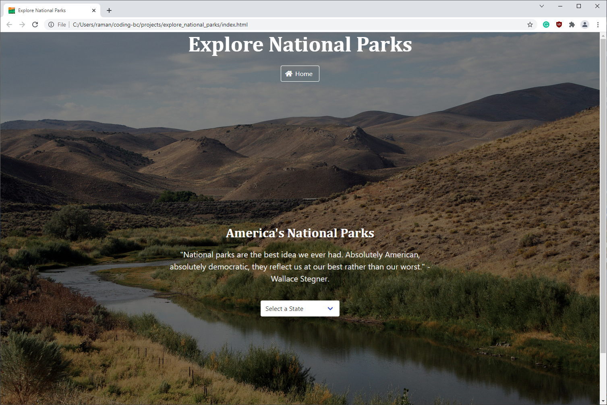
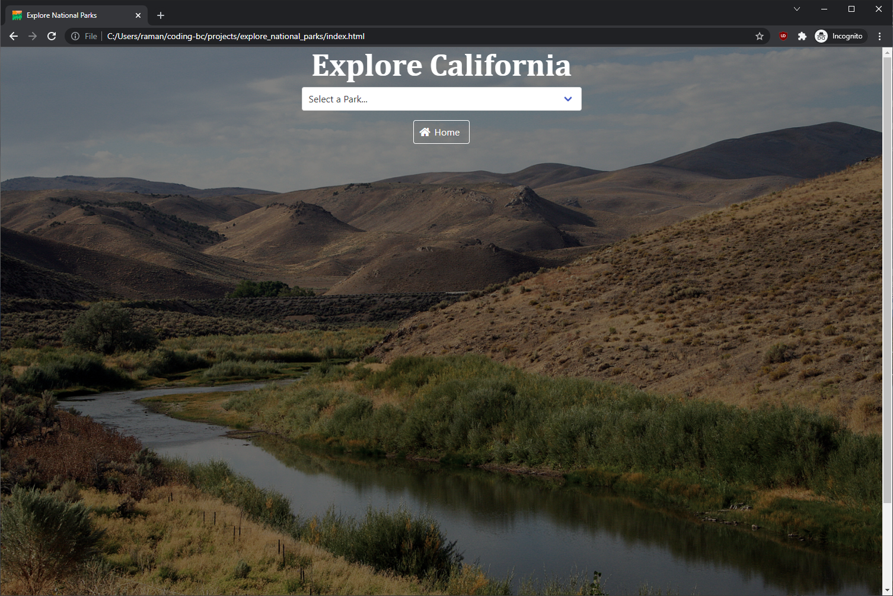

# Explore National Parks
An adventure portal into the world of America's National Parks.

## Table of contents
* [General info](#general-info)
* [Screenshot](#screenshots)
* [URLs](#urls)
* [Code](#code)
* [APIs](#api)
* [Developers](#developers)

## General info
**Explore National Parks** is an application that allows the user to select any state in America and get information about all the National Parks in that state.
The details include the full name and description of the National Park, the address, the phone and email addresses of the Park authority, the operating hours of the park, 
and the activities that are available in the Park. It also includes the current weather conditions at the Park and a 3-day forecast that will allow the user to plan their visit.

## Screenshot

## URL
* [Deployed Application](https://ramantv.github.io/explore_national_parks/)
* [GitHub Repository](https://github.com/ramantv/explore_national_parks)

## Code
* HTML
* CSS (including Bulma CSS framework)
* Javascript (including JQuery and Moment.js libraries)

## APIs
* National Park Service API
* OpenWeather API

## Developers
* *Rob Burson*, *Sam Davenport* and *Raman TV*.
